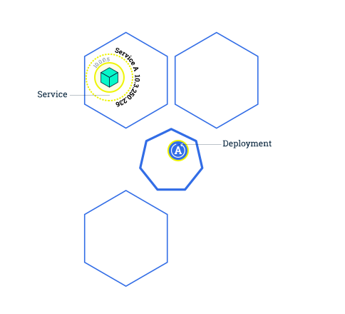

# Scaling

Scaling is accomplished by changing the number of replicas in a [Deployment](https://kubernetes.io/docs/concepts/workloads/controllers/deployment/). Scaling out a Deployment will ensure new Pods are created and scheduled to Nodes with available resources. 

## Example

### Before

### After

